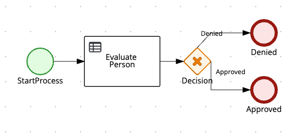

# Person Evaluation (Kogito + Spring Boot)

## Requisitos

- Java 21+
- Gradle 8.5+
- Docker (opcional para despliegue)

## Instalación

```bash
./gradlew clean build
```

## Ejecución

```bash
./gradlew bootRun
```

Accede a la API en `http://localhost:8080/persons` y el health check en `http://localhost:8080/actuator/health`.

## Testing

```bash
./gradlew test
```

## Postman

Importa `postman/PersonEvaluation.postman_collection.json` para probar los endpoints.

## Docker

```bash
docker build -t person-evaluation:1.0.0 .
docker run -p 8080:8080 person-evaluation:1.0.0
```

## Kubernetes

Manifiestos disponibles en `k8s/deployment.yaml` (no se aplican automáticamente).

## Diagrama BPMN del Proceso



> Coloca la imagen del diagrama en la ruta `docs/diagrams/person-bpmn.png` si aún no existe. El flujo ilustra el proceso de evaluación de una persona:

1. **StartProcess**: Evento de inicio que recibe los datos de la persona.
2. **Evaluate Person (Task / Decision)**: Paso que invoca la lógica (actualmente simulada) o un modelo DMN para determinar elegibilidad según la edad.
3. **Gateway (Decision)**: Diverge en dos rutas según el resultado:
   - `Approved` si la edad >= 18.
   - `Denied` si la edad < 18.
4. **End Events**: Eventos de fin diferenciados para cada resultado.

### Notas de Implementación Actual

- En esta versión del proyecto la lógica DMN está simulada en `PersonService` (condición edad >= 18).
- Cuando se incorpore un archivo `.dmn`, colocar el recurso en `src/main/resources` y reemplazar la lógica de `evaluateDMN` para usar el runtime de Kogito.
- El endpoint actual de decisión es `POST /persons/persons` con cuerpo `{ "Person": { "name": "...", "age": N } }`. Puede refactorizarse a un endpoint más claro (por ejemplo `/persons/eligibility`).

### Próximos Pasos Sugeridos

1. Añadir archivo DMN real (ej. `PersonEligibility.dmn`).
2. Adaptar servicio para invocar el modelo DMN y mapear salidas.
3. Actualizar pruebas para validar campos producidos por el modelo real.
4. Ajustar la colección Postman y README tras el refactor del endpoint.
